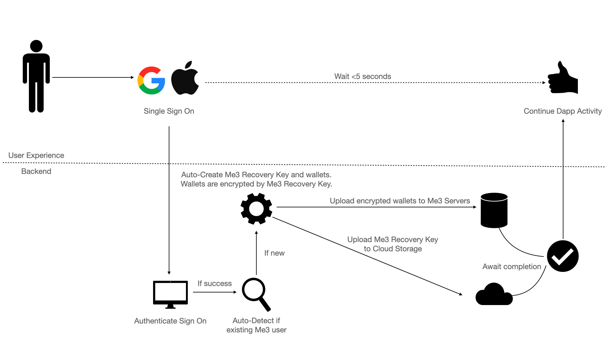
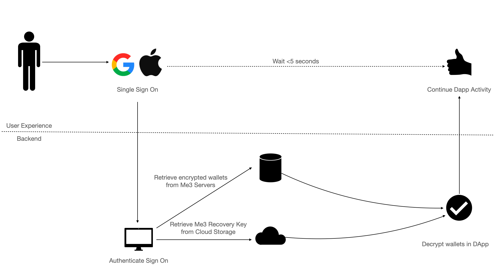
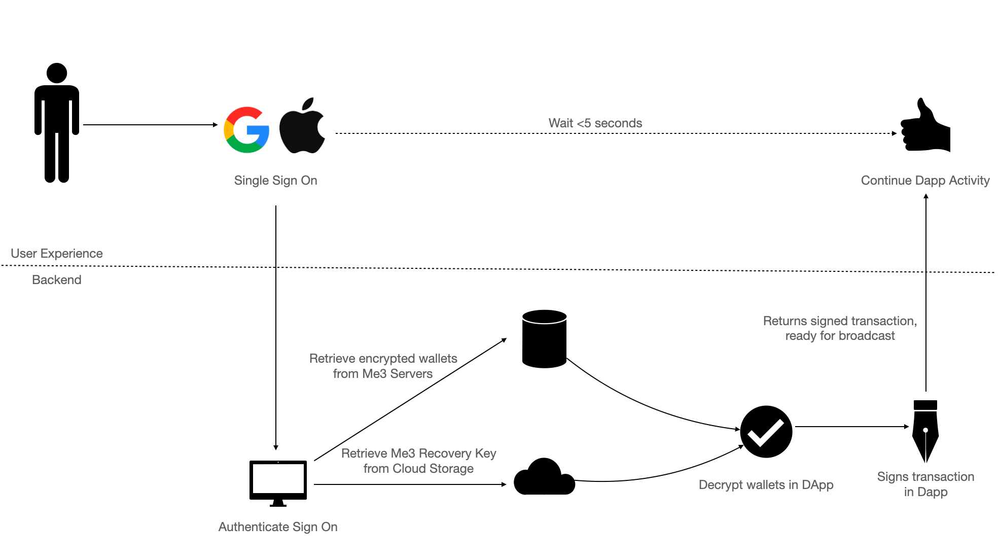

## Wallet Generation

The diagram below describes the backend process when creating a Me3 wallet for the end-user.

## Retrieving Wallets

Oftentimes in Web2.0, we face a choice: Login or Sign up. At Me3, we believe that we can further streamline the process by checking if they are an existing user at our backend.

If the user already has a Me3 Wallet, we

1. Retrieve the encrypted wallets from the Me3 servers, into the DApp.
1. Retrieve the Me3 Recovery Key from the Google Drive, into the Dapp.
1. Decrypt the wallets in the DApp.

That way, we enhance the user experience of both new and existing users to just one click.

## Signing Transactions

As part of our value-added services, we have abstracted away the need for you to write code for transaction signing purposes. Keysmith now offers a method for you to obtain signed transactions with one click.

Simply provide the `signTx()` method with a transaction object, and we will return the signed transaction to you after the user approves the Google prompt.

